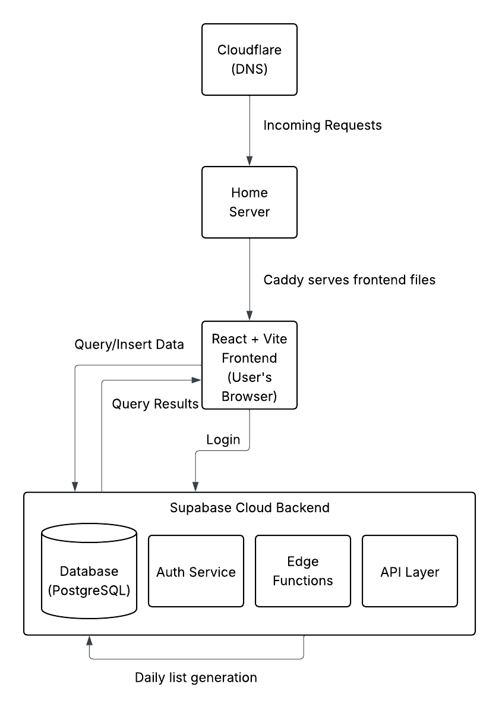
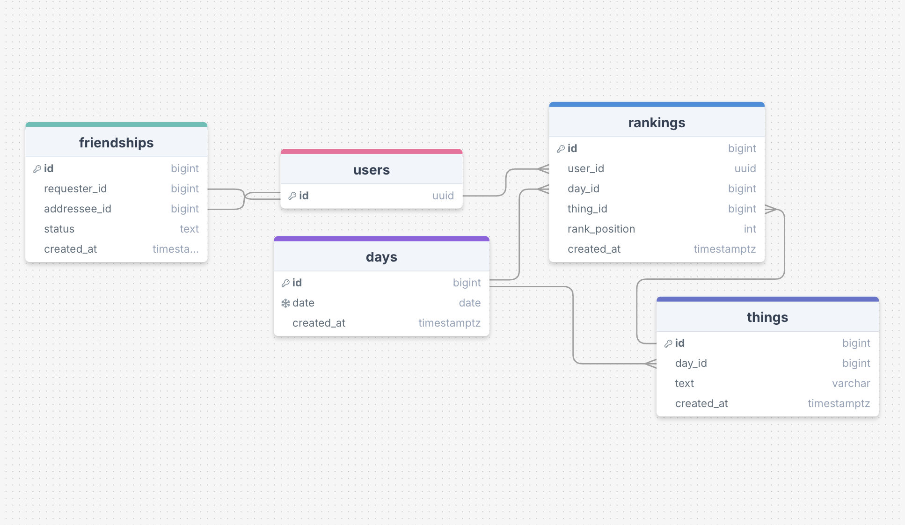

# RandomRank

### Purpose and Goal
My goal with this project is to build a web application where users can compare their personal rankings of random things. When I say random things, I quite literally mean *random things*. Trying to arrange wildly different objects, concepts, actions, feelings, and experiences on an arbitrary scale can be quite fun, especially when you do it with friends. Interesting discussions and debates will inevitably arise, and you may begin to realize just how much you value certain things, previously taken for granted. This concept is loosely based on the game [Cranium Whoonu](https://en.wikipedia.org/wiki/Cranium_Whoonu), a fun party game where you try to guess how much your friends value random things.

### System Design
As I begin the project, this is my current system design plan

### Database Design (ERD)
Here is my initial database design for the application. Note that the `users` table is built-in by Supabase.

### Timeline
Here is the timeline that I hope to follow with this project:
- **November 2nd - 8th:** Get all of the individual components and services up and running. Ensure that users can reach the project, create an account, and sign in.
- **November 9th - 15th:** Build out the pages and UX. Start testing ranking submissions and database read and writes.
- **November 16th - 22nd:** Continue working on database reading and writing. Add support for friends.
- **November 23rd - 29th:** Work on statistic queries and displays. Add special visualizations and statistic for friends.
- **November 30th - December 10th:** Tie up lose ends and polish the application.