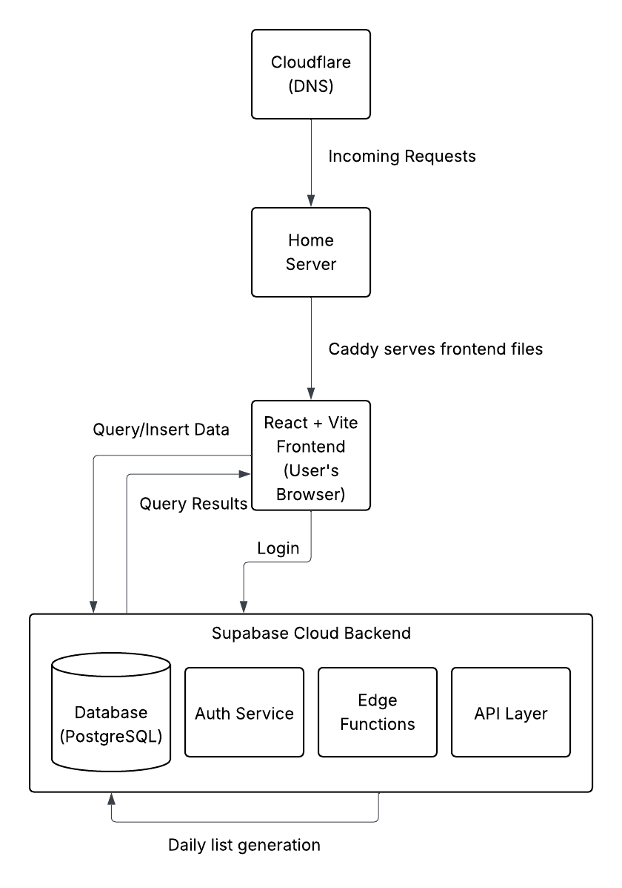
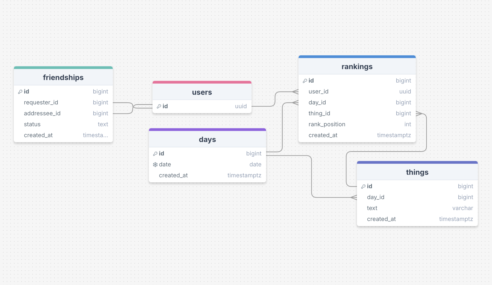

# RandomRank

### Purpose and Goal
My goal with this project is to build a web application where users can compare their personal rankings of random things. When I say random things, I quite literally mean *random things*. Trying to arrange wildly different objects, concepts, actions, feelings, and experiences on an arbitrary scale can be quite fun, especially when you do it with friends. Interesting discussions and debates will inevitably arise, and you may begin to realize just how much you value certain things, previously taken for granted. This concept is loosely based on the game [Cranium Whoonu](https://en.wikipedia.org/wiki/Cranium_Whoonu), a fun party game where you try to guess how much your friends value random things.

### Project Demo
Here is a [link](https://youtu.be/wiNbZ157deY) to a video demonstration of my site (recorded on December 10th, 2025).

### System Design
As I started the project, this was my original system design. I stayed pretty true to this design, the main difference being that I used scheduled cron jobs on my home server to automate tasks rather than Supabase edge functions.

### Database Design (ERD)
Here is my initial database design for the application. The final database design ended up being a little more complicated, but for security reasons I will not include a picture here.

### Project Follow Up

##### What I Learned
I learned a lot about web development, React, Typescript, Tailwind CSS, Supabase, row level security, and general database management. These were concepts I was largely unfamilair with before, but taking on a project like this was a great way to learn more!

##### AI Integrations?
Currently this project does not have any integration with AI, but I am considering using AI to generate better nouns that are a little "less random" and more interesting to compare and contrast.

##### AI Utilitzation
AI was extremely helpful in learning concepts, designing the UI, and writing database logic. This project was a helpful demonstration of the power of AI in web development.

##### Why this Project is Interesting
I enjoy playing online daily puzzle games and comparing my results with friends. I've also always been interested in web development, but until recently I did not have a sufficient understanding of databases to really create anything cool. This project was a fun opportunity to apply and further develop my knowledge of databases to make something interesting.

##### Key Learnings
1. React/Typescript, Taillwind CSS, and Supabase make up a powerful tech stack for webdevelopment.
2. Large language models are a powerful tool for all aspects of web development.
3. There are a lot of ways you can implement a database to meet the needs of a project. The best practice is to consider all of your goals up front and design a strong schema to work with from the start.

##### Scaling?
Right now I am using the free tier of Supabase (cloud hosted) and serving the site on my home server. To scale the project, I would need to move things over to a CDN and upgrade my version of Supabase. Some of the Supabase queries and logic would need to be restructured/optimized as well.